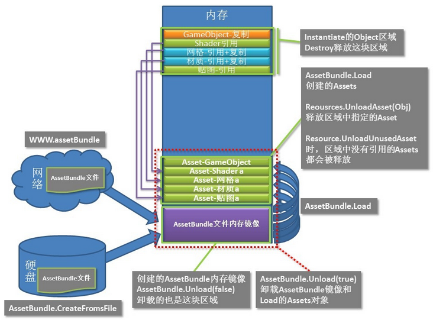
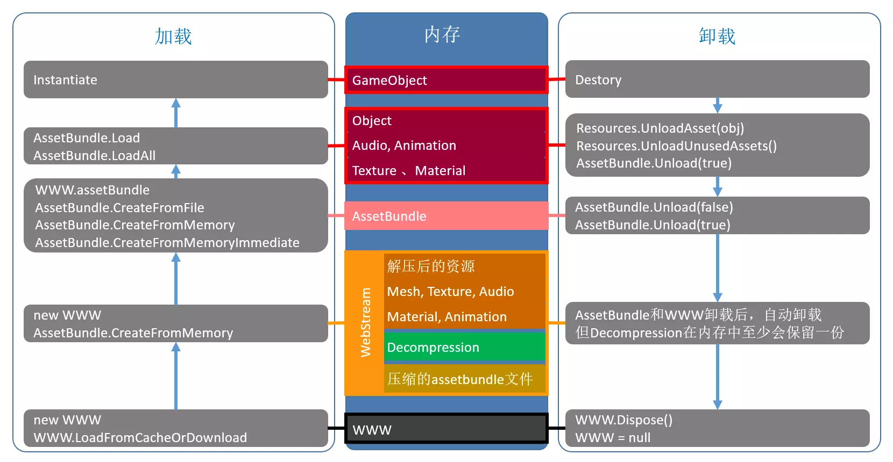

# AssetBundle概念
* 1 AssetBundle 是一个存档文件,包含可在运行时加载的特定于平台的资源（模型、纹理、预制件、音频剪辑甚至整个场景);AssetBundle 可以表达彼此之间的依赖关系;目前一般情况下采用 LZ4 压缩方式.
* 2 AssetBundle包含 2 种东西,序列化文件(引用)和资源文件;序列化文件包含分解为各个对象并写入此单个文件的资源,依赖关系,映射等;资源文件只是为某些资源（纹理和音频）单独存储的二进制数据块，允许我们有效地在另一个线程上从磁盘加载它们.
* 3 打包分为随包资源,以及增量包资源(热更资源).随包资源跟随 apk,ipa 进行安装;将打的增量包上传到平台资源发布(CDN)服务器,游戏内进行下载;

# 辅助理解
* 1. 了解AssetBundle的API,依赖关系,热更的含义.

* 2. 了解工具的使用,AssetStudio, https://github.com/Perfare/AssetStudio

* 3. 官方推荐的工具 AssetBundles-Browser 


# 第一步:了解复杂的Unity3D项目中的资源依赖关系

* 1. 
    |资源类型|资源类型关系|
    |--|--|
    |AnimationClip|Animation编辑的动画,或者FBX,3dMax等软件导入的动画片段,一般跟随的是Prefab进行打成一个包,也可以多个动画打成一个ab包|
    |AudioClip|音频动画,一般情况也是跟随prefab,也可以多个音频打成一个包|
    |VideoClip|视频动画,一般情况也是跟随prefab,也可以一个视频打成一个包,也可以随包安装,很大,不建议以AB包方式进行加载,可以采取其他方式,web播放,或者随包安装更好.|
    |Font|一个Font单独打成一个AB包,一般情况下是UI引用字体|
    |Mesh|一般跟随Prefab打成一个AB包,是AB包中的一个子资源|
    |Prefab|一个prefab就是一个ab包|
    |Scene|一个场景就是一个ab包|
    |Shader|一般情况下是所有shader打成一个ab包,在初始化的时候进行加载预热|
    |Texture|图片,一般跟随prefab,或者单独打成一个ab包,这个图片肯定很大|
    |SpriteAtlas|图集,小图的图集,一个图集一个ab包,或者有其他方式,目前很多UI的一个prefab中的所有图片成为一个图集|
    |Material|一个mat一个ab包,里面包含shader与Texture|
    |FBX|角色,一般情况是生成prefab,里面包含骨骼,蒙皮,图片,mat,shader,动画,等等很多资源,记住打包时,一定不能让这个资源重复,不能造成冗余|
    |txt/json|文本文件,单独下载,不打进AB包|
    |zip|压缩文件,不打进ab包的,单独下载|
    |...|其他特殊资源需要自定义依赖关系,打包,加载等等,一般情况下U3D内部的资源不能打成AB包的,可以通过Get请求单独下载|

* 2. 如何将庞大又复杂的资源打成AB包呢? 需要使用U3D中的依赖查找关系的方法;在U3D的Project视图中,右键选择 Select Dependencies 可以查找到此对象所依赖的资源,如果想知道,哪个资源依赖了此资源,则需要用到下面的方法
    ```
        正向依赖查找:AssetDatabase.GetDependencies("xxx");
        反向依赖查找:
        private static readonly string[] SearchObjects =
        {
            ".prefab", 
            ".unity", 
            ".mat", 
            ".asset",
            ".controller",
            ".anim",
            ".ttf",
            ".shadervariants",
            ".shader",
            ".spriteatlas",
            ".spriteatlasv2",
        };
        string path = AssetDatabase.GetAssetPath(Selection.activeObject);
        string guid = AssetDatabase.AssetPathToGUID(path);
        string[] files = Directory.GetFiles(Application.dataPath, "*.*", SearchOption.AllDirectories)
            .Where(s => SearchObjects.Contains(Path.GetExtension(s).ToLower())).ToArray();
        int length = files.Length;
        for (int i = 0; i < length; i++)
        {
            string filePath = files[i];
            bool isCancel = EditorUtility.DisplayCancelableProgressBar("匹配资源中", filePath, (float) i / length);
            if (Regex.IsMatch(File.ReadAllText(filePath), guid))
            {
                Debug.Log(filePath + "  引用到 " + path);
            }
        }
    ```

* 3. 资源之间的依赖,并不能确认AB包之间是否有依赖关系,只能等打出AB包之后,根据AssetBundleManifest来判断AB包之间的关系,        
但是如果熟悉AB包之间的打包依赖规则,就可以很明确的推断,资源打成AB包之后是否存在依赖关系了!

# 第二步:设置AB包的打包方式

* 4. 在此提供一种AB包的打包方式,可以依照此策略来进行打包,但此种打包方式可以基本满足所有需求.
* 5. 在Assets文件夹下创建BuildAssets文件夹

* 6. 打包时,只搜索BuildAssets文件夹内的资源,在
    ```
        AllFileExtension = new Dictionary<string, string[]>()
        {
            { "Animates",     new []{".anim",".controller"} },
            { "Binarys",      new []{".zip"} },
            { "Configs",      new []{".asset"} },
            { "Fonts",        new []{".ttf",".asset"} },
            { "Materials",    new []{".mat"} },
            { "Prefabs",      new []{".prefab"} },
            { "Scenes",       new []{".unity"} },
            { "Shaders",      new []{".shader",".shadervariants"} },
            { "SpriteAtlas",  new []{".spriteatlas",".spriteatlasv2"} },
            { "Textures",     new []{".png",".jpg",".jpeg","hdr"} },
        };
    ```
类型中搜索文件,根据后缀名字进行打成一个AB包,不会根据文件夹打成一个AB包,即最小颗粒度到一个资源.

* 7. 然后BuildAssets文件夹内的资源依赖其他文件夹内的资源,而不是BuildAssets文件夹内的资源互相依赖,此方式必须要每天进行一次检查,也就是说,BuildAssets文件夹内的每个资源都是一个AB包.如果其他文件夹内的资源被依赖次数超过5次,并且 5*size 大于100KB,则将其设定为一个AB包,并通知开发人员,将其移动到BuildAssets文件夹内.

* 8. 每个文件夹都有其含义,并且根据后缀名字进行搜索资源打包,打包时将后缀名字全部小写匹配,打包方法采用
    ```
            public static AssetBundleManifest BuildAssetBundles(
            string outputPath,
            AssetBundleBuild[] builds,
            BuildAssetBundleOptions assetBundleOptions,
            BuildTarget targetPlatform)

            伪代码:
            var assetBundleManifest = BuildPipeline.BuildAssetBundles(
            "output path", 
            builds, 
            BuildAssetBundleOptions.ChunkBasedCompression, //LZ4,其他不用关心,基本都开启了
            EditorUserBuildSettings.activeBuildTarget);
    ```
    此方法需要手动制作AssetBundleBuild对象,这就是我们收集资源并且打成AB包的规则.

* 9. 每次打包需要将打包的version.json版本文件上传到SVN,以便于下次对比打出热更包.
* 10. 每次打包出来的 assetBundleManifest 需要代码检查,其中不能出现互相依赖的包体,如果出现互相依赖的包体,需要通报开发人员.


# 第三步:热更新

* 11. 每次进入游戏时,都需要向服务器请求最新版本的version.json文件,用来与本地的version.json文件进行对比,如果缺少什么,就下载什么,下载完毕对每个AB包进行MD5校验.不对的就删除重新下载,对比的MD5不同或者不存在就进行覆盖或者下载.

* 12. 另有一种边玩边下的线程,需要用户同意,开启新线程,进行资源下载.

* 13. 如果Lua文件不多,则直接打成zip整个更新即可,如果重度依赖lua,则需要每个星期更新一点,道理与更新AB包是一致的,只不过Lua文件不属于AB包的范畴.也可以将热更的Lua文件使用一个AB包进行收集,然后热更.方法多种多样,在整个系统中,热更新是最简单的了

# 第四步:加载AB包





* 14. 三层内存与AB的关系都在图中表现出来了.

* 15. AB加载的方案是从磁盘加载,严禁从网络加载,这点在正规的游戏开发中都是这么做的!加载方法
    ```
        //从磁盘上加载AB包
        public static AssetBundle LoadFromFile(string path) //同步加载
        public static AssetBundleCreateRequest LoadFromFileAsync(string path)//异步加载

    ```

* 16. 在磁盘上面,AB包是一个zip包,经过了LoadFromFile方法调用之后,AssetBundle对象是镜像内存.镜像内存解压成资源,资源再被实例化成可以在Hierarchy(类似)上面使用的GameObject,也可以说是在Hierarchy(图形显示)容器内.

* 17. 单纯卸载一个AB包的镜像内存需要使用 AssetBundle.Unload(false); 


# 第五步:加载AB包内的资源

* 18. 从AssetBundle对象中,加载进内存,也就是从镜像内存解压了一份出来.类比在电脑上解压了一份ZIP,此时ZIP与解压的东西都存在磁盘上,同理,AB包此时在内存中存在2份一份是压缩文件,一份是解压的文件.
    ```
        //从AB包的镜像压缩内存中解压出资源    
        public Object[] LoadAllAssets()
        public T LoadAsset<T>(string name);
    ```

#### 卸载这个地方的内存是极其恶心的问题,很多人在这个地方肯定会踩坑,这个地方的API也机器混乱,下面如果不对,请及时联系并指出.

* 19. 单纯卸载一个AB包解压的内存需要使用 Resources.UnloadAsset(Object assetToUnload);

* 20. 卸载全部的目前没有使用的解压的内存需要使用 Resources.UnloadUnusedAssets();

* 21. 单纯卸载一个AB包的解压的内存与镜像内存 AssetBundle.Unload(true); 

* 22. 卸载所有AB包目前没有在被使用的解压的内存与镜像内存 AssetBundle.UnloadAllAssetBundles(false);

* 23. 卸载所有AB包的解压的内存与镜像内存 AssetBundle.UnloadAllAssetBundles(true);

# 第六步

* 23. 实例化prefab;将解压的内存进行实例化,此实例化只有prefab需要,其他AB包里面的资源如果不属于prefab就不需要实例化,prefab本身是一个文本文件,里面全是引用. 可以将prefab当成一个类模板,而其他资源类型的AB包,则可以被直接使用.
    ```
        UnityEngine.Object.Instantiate<GameObject>(template);
    ```

* 24. 此时的卸载与上面的AB没有关系了UnityEngine.Object.Destroy(xxx);即可

* 25. 在 Unity3d 中的 Editor 模式下,我们需要在Hierarchy 上看到我们设计的代码以及资源分布.在运行期间我们看不到此景象,需要在脑子里面模拟此景象. 这时,当我们要创建一个东西,需要引用或者复制 AB 包解压缩出来的资源文件.

* 26. 在 Editor即在 Hierarchy 上看到的一个 Image 组件,上面有一张 Texture 是在磁盘上.在运行时 ,Image 引用的是内存中的 Texture.上面的关系要分清楚. 

* 27. 运行时态,在对象要在Hierarchy(图形显示容器)中创建时, GameObject 肯定是复制一份的,也就是说在整个 AB加载期间中,可能存在三份内存.
网格与材质可能是引用(使用的是 sharedMesh/sharedMaterial)也许是复制(使用的是mesh/material).也就是说肯定存在两份内存,也许存在三份内存
shader与 Texture 是引用 AB 的解压缩文件的,也就是说肯定是两份内存.
* 28. 
        上面的内存分析      
        三份内存:从磁盘中加载到内存中的压缩文件 ,
        解压缩出来的资源文件.
        在Hierarchy中创建的对象.

        两份内存:从磁盘中加载到内存中的压缩文件 ,
        解压缩出来的资源文件
